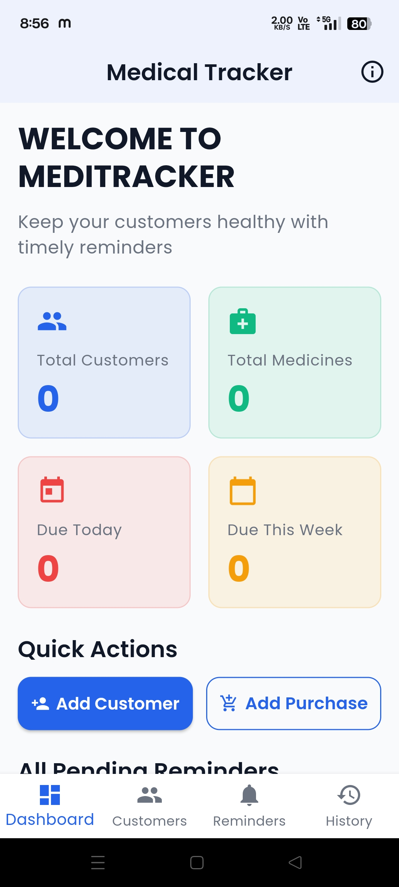
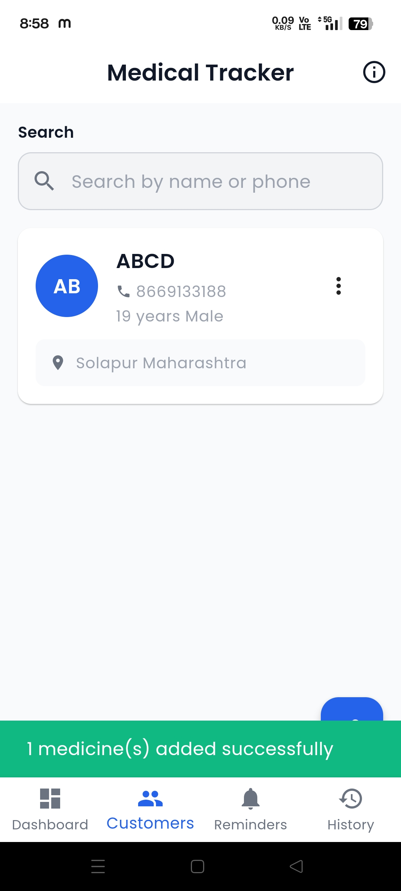
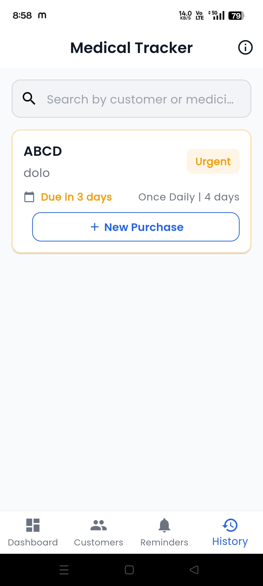
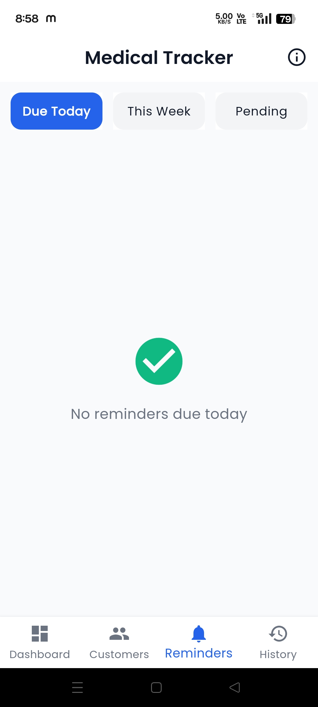

# medica_tracker

# MediTracker – Medicine Reminder Application

## 📌 Overview
MediTracker is a Flutter-based mobile application designed to help medical store owners manage customers, medicines, and purchase records. The application also sends medicine reminders using SMS and WhatsApp while storing data locally using SQLite.

## ✨ Features
- Customer Management
- Medicine Management
- Purchase Management
- Medicine Reminder System
- SMS & WhatsApp Reminder Integration
- Offline Data Storage using SQLite
- Simple and User-Friendly Interface

## 🛠 Technologies Used
- Flutter
- Dart
- SQLite
- Provider
- Android Studio

## 📱 How to Run
1. Clone this repository.
2. Run `flutter pub get`
3. Connect an Android device or emulator.
4. Run `flutter run`

## 📸 Screenshots

### Home Screen

### Customer/Medicine Screen

### Purchase Screen

### Reminder Screen

## 👨‍💻 Developer
**Hrushikesh Karampuri**

## Getting Started

This project is a starting point for a Flutter application.

A few resources to get you started if this is your first Flutter project:

- [Lab: Write your first Flutter app](https://docs.flutter.dev/get-started/codelab)
- [Cookbook: Useful Flutter samples](https://docs.flutter.dev/cookbook)

For help getting started with Flutter development, view the
[online documentation](https://docs.flutter.dev/), which offers tutorials,
samples, guidance on mobile development, and a full API reference.
